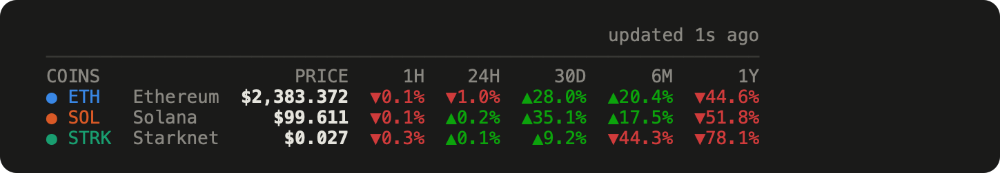
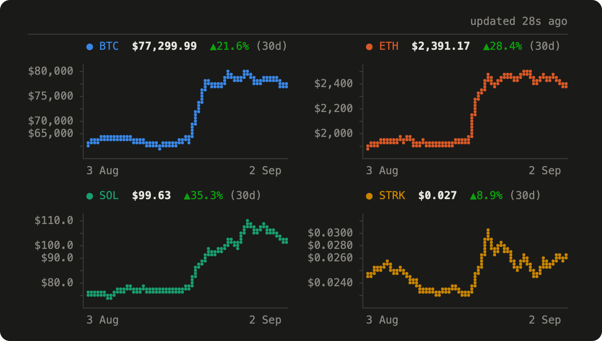
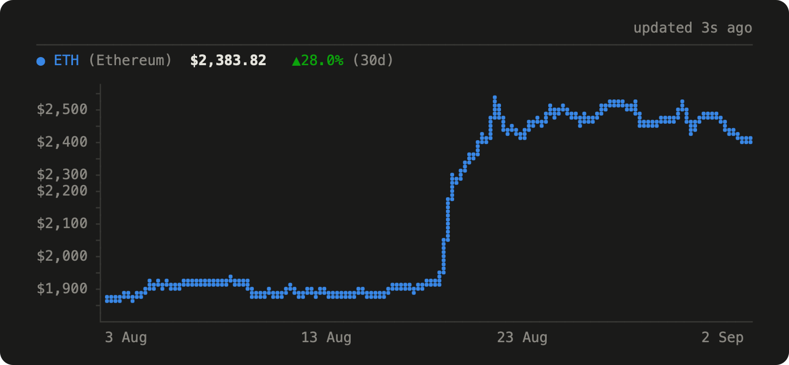
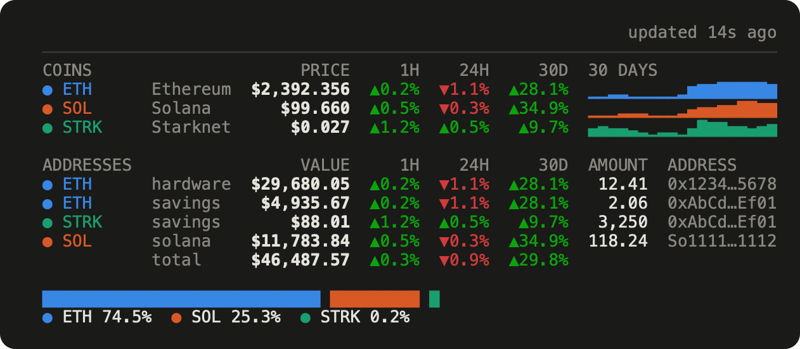

# coins

[](https://github.com/msimkin/coins/actions/workflows/ci.yml)

Cryptocurrency prices, charts and holdings in your terminal. Prices come from
[CoinGecko](https://docs.coingecko.com), quoted directly in your own currency.



One row per coin: the price, then a change column for every period you name.

`coins plot` draws the charts, as many to a row as the terminal fits:



`coins eth` draws one of them alone:



Curves are braille dots, 2×4 to a character cell, so they stay smooth at any width.

## Install

Rust 1.86 or newer.

```sh
git clone https://github.com/msimkin/coins
cargo install --path coins
coins completions install   # tab completion, one line into ~/.zshrc or ~/.bashrc
```

The first run writes `~/.config/coins/config.toml` with every option commented.

## Use

```sh
coins                 # prices
coins plot            # the charts
coins eth             # one coin, full width
coins add sol         # track a coin, by ticker, name or CoinGecko id
coins add 0xd8dA…     # track an address; its balances become holdings
coins rm sol          # stop tracking a coin or an address
coins balance         # prices, what each address holds, and the portfolio
coins top             # the fifty largest coins, by market capitalisation
coins config --edit   # open the config in $EDITOR
```

Any unambiguous prefix works: `coins b` is `coins balance`, `coins p` is `coins
plot`. `-c eur` and `-r 1m` change the currency and the period for one run, and
`coins add 0xd8dA… --label trezor` names an address in the ADDRESSES group.

`add` takes only an exact match on id, ticker or name, so a typo cannot quietly
become a coin you did not mean:

```
$ coins add bitcon
coins: no coin is called "bitcon" — did you mean one of these?
  bitcone (CONE, #5384)
(add by id, e.g. `coins add bitcone`)
```

The 250 largest coins are built in, so `coins add btc` needs no request. Tab
completion offers the same list.

## A screen that keeps itself current

`--live` turns any view into a display that redraws on a timer:

```sh
coins --live           # the prices
coins balance --live   # what you hold
coins top --live       # the market
```

`live = 60` in the config sets the seconds between redraws — prices are cached for
a minute, so a faster tick repaints the same numbers. It redraws in place and takes
nothing over, so Ctrl-C, a kill, or a pulled plug all leave the terminal as they
found it. A refresh that fails does not clear the screen: the last frame stays, with
a line saying what happened and when the next attempt is, and the age in the header
keeps climbing.

The frame is centred on the screen in live mode, since a display has no prompt to
sit under, and it follows the window: resizing redraws within a quarter second
rather than waiting for the next refresh.

For a machine that boots into it — a Raspberry Pi wired to a small screen — that is
the whole setup, plus `setterm -cursor off` to hide the cursor and an autologin
shell or a systemd unit to start it.

## Configure

Everything lives in `~/.config/coins/config.toml`:

```toml
coins       = ["bitcoin", "ethereum"]  # tracked coins; order fixes each coin's colour
currency    = "usd"                    # any CoinGecko vs_currency: usd, eur, gbp, btc, …
range       = "1w"                     # how much history a chart covers
columns     = ["1h", "24h", "7d"]      # 1h 24h 7d 14d 30d 3m 6m 200d 1y

inline_plot = false                    # a sparkline on every row, except in `coins top`
show_addresses = false                 # let plain `coins` show holdings too
balance     = "all"                    # `coins balance`: all | addresses
height      = 14                       # chart height, in terminal rows
top         = 50                       # rows in `coins top`, 1 to 50
live        = 60                       # seconds between redraws under `--live`
thousands   = " "                      # digit grouping: " " | "," | "." | ""
max_decimals = 3                       # ceiling on price decimals
theme       = "dark"                   # dark | light
api_key     = ""                       # a CoinGecko demo key raises the rate limit

[holdings]                             # coins held somewhere with no address
bitcoin = 0.25

[[wallets]]                            # read-only on-chain balances
address = "0x…"
label   = "main"
```

Every price in a column shares one decimal count — as many as its neediest row
needs, up to `max_decimals` — so the decimal marks line up on their own.

`coins add` and `coins rm` edit the file in place, leaving your comments alone.
`coins config` never parses it, so a file the tool refuses to read still has a way
in.

## Holdings

Two sources, which add up: `[holdings]` in the config, for coins held somewhere
without an address, and `coins add <address>` for balances read from the chain. The
chain follows from the address — `0x` and 40 hex digits is Ethereum, 43–44 base58
characters is Solana — and one address holds the chain's own coin plus any token you
track, so the group has a row per holding rather than per address. A Solana address's
stake accounts are counted with its liquid SOL; ether staked in a validator is not
visible from an address at all, though a liquid-staking token is, once you track it.



The addresses and amounts above are made up.

**Plain `coins` shows prices only** — no addresses, no portfolio — so checking the
market with someone beside you does not put your holdings on the screen. `coins
balance` is the full picture. Two options move that line: `show_addresses = true`
puts holdings in every view, and `balance = "addresses"` leaves the coin table out
of `coins balance`, so the two commands divide the screen between them.

A token you hold but do not track stays invisible until you `coins add` it. Whichever
RPC endpoint answers sees the address you asked about; the defaults are public nodes,
and `rpc = "…"` on a wallet points at your own.

## Prices

The keyless CoinGecko API allows roughly 5–15 requests a minute; a free demo key in
`api_key` raises it to 100. At `range = "1w"` a screen is one request, which carries
every price, every change column and a week of history together. Other ranges need a
chart per coin, as do the `3m` and `6m` columns — one chart serves both, since 180
days of history contains the last 90.

That one request also carries **the fifty largest coins**, a week of history each,
not just the coins you track. So `coins doge` answers at once and draws a chart for
a coin you have never added, and keeps doing both while the API is rate-limiting or
unreachable. No extra request: about 200 KB in place of 13, since a week of history
is roughly 3 KB a coin. A chart over a longer range still costs one request for the
coin you asked for — and when it cannot be made, the week stands in and the label
says `7d` rather than claiming the range.

`coins top` ranks those fifty by market capitalisation — circulating supply times
price, which is what makes a coin large. Not by price per unit, which says only how
finely a supply was divided: XRP at €1.16 is worth more than BNB at €592. The `#` is
the coin's place in the whole market, so a coin of yours from further down appears
below the rest at its own rank rather than at the end of the queue:

```
    7  ● SOL   Solana        €85.976  €50.3B  ▼0.1%  ▲1.4%  ▲35.1%  ▼52.0%

  174  ● STRK  Starknet       €0.023   €165M  ▼0.2%  ▲4.8%   ▲7.5%  ▼78.5%
```

Your own coins keep their colour, pegged coins are greyed — they are dollars in
another wrapper, not price action — and everything else is plain. `coins top 10`
shortens the list for one run; `top` in the config sets it for good. Like the coins
themselves the screen costs no request, which is why it shows only the periods the
prices carry: a `3m` or `6m` column is a chart per coin, and fifty of those is not a
screen worth paying for. Which fifty they are comes from the built-in list, so
membership is a snapshot while the order is live — a `#57` inside the list is the
sign to regenerate it.

**A screen goes up before any request is made.** It is drawn from the last data on
disk and replaced when fresh data arrives, so a slow connection costs a redraw
rather than a blank terminal: `coins plot` with stale prices and stale charts used
to sit empty for as long as four requests took, and now shows the old charts at
once. Within an hour of a cached picture nothing is fetched in the foreground at
all — the screen is drawn from the cache, its header says how old it is, and a
background refresh makes the next run current. `--refresh` skips all of that, which
is what it is for.

Charts are cached in `~/.cache/coins` for five minutes to a day, depending on how
fast the period moves. The top line always states the age of what you are looking at,
and says `offline` or `rate-limited` when it could not refresh.

## Maintenance

`src/coins.rs` holds the built-in coin list. `coins __popular` prints a fresh one from
CoinGecko, ready to replace everything below that file's header.

## Licence

MIT — see [LICENSE](LICENSE).

Prices are fetched at runtime under CoinGecko's
[API terms](https://www.coingecko.com/en/api_terms); nothing from them is
redistributed here.
